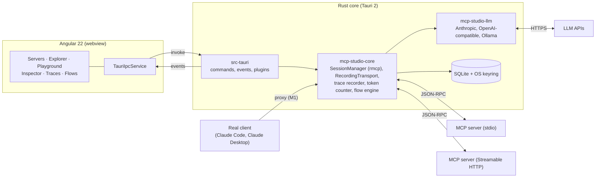

# Architecture

Three layers: Angular renders, Rust connects and measures, SQLite and the OS keyring store. The core
crate (`mcp-studio-core`) does not know about Tauri, so it can later be reused as a CLI for CI tests.

Every message between the core and an MCP server passes through the `RecordingTransport`; the
inspector, tracing, and token metering all read from what it records.

## Rust backend

All MCP connections, secrets, and measurements live in Rust; the frontend talks to it only through
Tauri commands and events. stdio processes therefore run outside the browser sandbox, and the
webview never sees an API key.

### Cargo workspace

| Crate | Responsibility |
|---|---|
| `crates/mcp-studio-core` | Domain without Tauri: server registry, session manager, recorder, token counter, flow engine. Tested with `cargo test` |
| `crates/mcp-studio-llm` | LLM provider abstraction (Anthropic first, OpenAI-compatible and Ollama later) for flows and AI features |
| `src-tauri` | Thin layer: commands, events, plugins, app state |

### Building blocks

- **MCP client**: the official Rust SDK `rmcp` with the `child-process` (stdio) and Streamable HTTP
  transports. A `SessionManager` holds one `RunningService` per server and manages reconnects and
  lifecycle.
- **Interception**: every transport is wrapped in a `RecordingTransport` that records each raw
  JSON-RPC message (direction, timestamp, bytes) before `rmcp` parses it. See
  [recording-and-observability.md](recording-and-observability.md).
- **Proxy mode (MVP)**: MCP Studio exposes a local stdio or HTTP endpoint that forwards to a real
  server. Claude Desktop or Claude Code point at the proxy, and every call shows up in the inspector.
- **Persistence**: SQLite via `sqlx` (servers, collections, history, traces, flows). Secrets in the
  OS keyring (`keyring` crate), never in the database. See [data-model.md](data-model.md).
- **Async**: `tokio`; long-running calls are cancellable (`notifications/cancelled`) and report
  progress as Tauri events.
- **Plugins**: `tauri-plugin-store` (UI settings), `tauri-plugin-single-instance`,
  `tauri-plugin-dialog` (import/export), `tauri-plugin-opener` (OAuth redirect in the browser).
- **Environment**: stdio servers are spawned with the login-shell `PATH` resolved at startup, so
  `npx` and `uvx` work from the GUI app; overridable per server.

### IPC contract

Types are generated from Rust into TypeScript with `specta` + `tauri-specta`, so Angular and Rust
cannot drift apart. Initial surface:

| Kind | Name | Purpose |
|---|---|---|
| Command | `server_list`, `server_add`, `server_update`, `server_remove` | Registry CRUD |
| Command | `server_import` | Import from client config files |
| Command | `server_connect`, `server_disconnect` | Session lifecycle |
| Command | `tools_list`, `resources_list`, `prompts_list` | Explorer |
| Command | `tool_call`, `resource_read`, `prompt_get`, `request_cancel` | Playground |
| Command | `messages_query`, `trace_query` | Inspector and traces |
| Command | `proxy_start`, `proxy_stop` | Proxy mode |
| Event | `mcp://status` | Connection state per server |
| Event | `mcp://message` | Each recorded JSON-RPC message |
| Event | `mcp://progress` | Progress notifications of running calls |
| Event | `flow://step` | Flow run progress (M3) |

## Angular frontend

Angular 22 with standalone components, signals, and zoneless change detection; structure as in Bench
(`core`, `features`, `ui`); pnpm and Vitest.

| Folder | Contents |
|---|---|
| `core/` | `TauriIpcService` (typed wrappers generated by `tauri-specta`), event streams as signals, error handling |
| `features/servers/` | Registry, server form, import from client configs |
| `features/explorer/` | Tools, resources, and prompts of a server |
| `features/playground/` | Tool call with schema form and JSON editor (CodeMirror 6, as in Bench) |
| `features/inspector/` | Message timeline, detail view, diff between calls |
| `features/traces/` | Span waterfall, token and cost breakdown |
| `features/flows/` | Graph editor (`@foblex/flow`) and runner |
| `ui/` | Shared building blocks: split panes, JSON viewer, tabs, status bar |

- **Layout**: three columns like Postman — servers and collections on the left, a tabbed workspace
  in the middle, the inspector on the right or at the bottom. Dark theme first.
- **State**: signal-based stores per feature (no NgRx). Rust is the source of truth; the frontend
  holds only view state and subscribes to events.
- **Libraries**: CodeMirror 6 (JSON, Markdown, YAML); a small in-house JSON Schema form generator for
  the subset MCP tools use (instead of a heavy Formly dependency); `@foblex/flow` for the flow editor.
