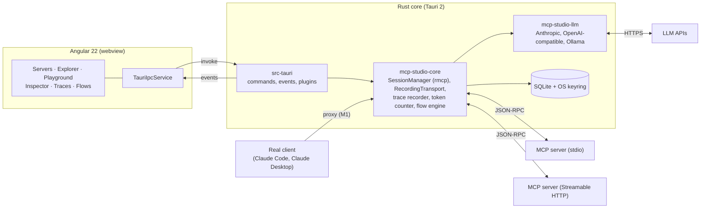

# Architecture

Three layers: Angular renders, Rust connects and measures, SQLite and the OS keyring store. The core
crate (`mcp-studio-core`) does not know about Tauri, so it can later be reused as a CLI for CI tests.

Every message between the core and an MCP server passes through the `RecordingTransport`; the
inspector, tracing, and token metering all read from what it records.

## Rust backend

All MCP connections, secrets, and measurements live in Rust; the frontend talks to it only through
Tauri commands and events. stdio processes therefore run outside the browser sandbox, and the
webview never sees an API key.

### Cargo workspace

| Crate                    | Responsibility                                                                                                         |
| ------------------------ | ---------------------------------------------------------------------------------------------------------------------- |
| `crates/mcp-studio-core` | Domain without Tauri: server registry, session manager, recorder, token counter, flow engine. Tested with `cargo test` |
| `crates/mcp-studio-llm`  | LLM provider abstraction (Anthropic first, OpenAI-compatible and Ollama later) for flows and AI features               |
| `src-tauri`              | Thin layer: commands, events, plugins, app state                                                                       |

### Building blocks

- **MCP client**: the official Rust SDK `rmcp` with the `child-process` (stdio) and Streamable HTTP
  transports. A `SessionManager` holds one `RunningService` per server and manages reconnects and
  lifecycle.
- **Interception**: every transport is wrapped in a `RecordingTransport` that records each raw
  JSON-RPC message (direction, timestamp, bytes) before `rmcp` parses it. See
  [recording-and-observability.md](recording-and-observability.md).
- **Proxy mode**: `mcp-studio-proxy` (stdio, see below) and a local HTTP endpoint
  (`http://127.0.0.1:38465/mcp/<server>`, `http_proxy.rs`) forward to real servers. Claude Desktop or
  Claude Code point at them, and every call shows up in the inspector.
- **Persistence**: SQLite via `sqlx` (servers, collections, history, traces, flows). Secrets in the
  OS keyring (`keyring` crate), never in the database. See [data-model.md](data-model.md).
- **Async**: `tokio`; long-running calls are cancellable (`notifications/cancelled`) and report
  progress as Tauri events.
- **Plugins**: `tauri-plugin-store` (UI settings), `tauri-plugin-single-instance`,
  `tauri-plugin-dialog` (import/export), `tauri-plugin-opener` (OAuth redirect in the browser).
- **Environment**: stdio servers are spawned with the login-shell `PATH` resolved at startup, so
  `npx` and `uvx` work from the GUI app; overridable per server.

### IPC contract

Types that cross the boundary derive `specta::Type` in `mcp-studio-core`; `specta-typescript` generates
`src/app/core/bindings.ts`, and a test fails when the checked-in file is stale (`pnpm bindings`
regenerates it). This replaces `tauri-specta`, which lags behind the current `specta` release; commands
are wrapped by hand in `TauriIpcService`, one method per command.

| Kind    | Name                                                                                        | Purpose                                     |
| ------- | ------------------------------------------------------------------------------------------- | ------------------------------------------- |
| Command | `server_list`, `server_get`, `server_add`, `server_update`, `server_remove`                 | Registry CRUD                               |
| Command | `import_sources`, `import_preview`, `import_apply`                                          | Import from Claude Desktop / Claude Code    |
| Command | `environment_list`, `environment_add`, `environment_update`, `environment_remove`           | Environments and variables                  |
| Command | `secret_set`, `secret_delete`                                                               | Keyring access (values never come back)     |
| Command | `server_connect`, `server_disconnect`, `server_logs`                                        | Session lifecycle and log buffer            |
| Command | `oauth_sign_in`, `oauth_sign_out`, `oauth_status`                                           | OAuth 2.1 for Streamable HTTP servers       |
| Command | `server_details`, `tools_list`, `resources_list`, `resource_templates_list`, `prompts_list` | Explorer                                    |
| Command | `tool_call`, `request_cancel`, `resource_read`, `prompt_get`                                | Playground                                  |
| Command | `collections_tree`, `collection_*`, `request_save/update/delete`                            | Collections and saved requests              |
| Command | `collection_export`, `collection_import`                                                    | Portable collection files                   |
| Command | `history_list`, `history_clear`                                                             | Request history                             |
| Command | `messages_query`                                                                            | Inspector                                   |
| Command | `proxy_info`, `proxy_set_environment`                                                       | Proxy mode                                  |
| Event   | `mcp://status`                                                                              | Connection state per server                 |
| Event   | `mcp://message`                                                                             | Each recorded JSON-RPC message              |
| Event   | `mcp://log`                                                                                 | stderr lines and MCP log notifications      |
| Event   | `mcp://list-changed`                                                                        | Tools/resources/prompts changed on a server |
| Event   | `mcp://progress`                                                                            | Progress notifications of running calls     |
| Event   | `flow://step`                                                                               | Flow run progress (M3)                      |

### Other building blocks

- **Sessions** (`session.rs`): one `rmcp` client per server; the transport is wrapped in the
  `RecordingTransport`; stdio servers get the login-shell `PATH` and their stderr is captured; an
  `initialize` timeout and automatic reconnect (1 s, 3 s, 8 s) after unexpected disconnects.
- **OAuth** (`oauth.rs`): browser sign-in through `rmcp`'s `AuthorizationManager` (discovery, dynamic client
  registration, PKCE) with a loopback redirect listener; credentials are one keyring entry per server
  (`oauth/<server id>`) and refresh automatically.
- **Placeholders** (`placeholders.rs`): `{{variable}}` in arguments, headers, URLs, and tool inputs, resolved
  from the active environment; undefined variables are reported all at once.
- **Collections** and **history** (`collections.rs`, `history.rs`): saved requests (portable JSON files
  reference servers by name) and a bounded log of everything sent; history stores arguments as entered and
  results with secrets masked.
- **Client import** (`client_import.rs`): reads `mcpServers` sections; secret-looking values move to the
  keyring.
- **Reference servers**: `mcp-studio-testserver` (stdio, `--http`, `--oauth`) for deterministic
  integration tests, plus compatibility tests against `@modelcontextprotocol/server-everything`.

## Angular frontend

Angular 22 with standalone components, signals, and zoneless change detection; structure as in Bench
(`core`, `features`, `ui`); pnpm and Vitest.

| Folder                 | Contents                                                                                                 |
| ---------------------- | -------------------------------------------------------------------------------------------------------- |
| `core/`                | `TauriIpcService` (typed wrappers generated by `tauri-specta`), event streams as signals, error handling |
| `features/servers/`    | Registry, server form, import from client configs                                                        |
| `features/explorer/`   | Tools, resources, and prompts of a server                                                                |
| `features/playground/` | Tool call with schema form and JSON editor (CodeMirror 6, as in Bench)                                   |
| `features/inspector/`  | Message timeline, detail view, diff between calls                                                        |
| `features/traces/`     | Span waterfall, token and cost breakdown                                                                 |
| `features/flows/`      | Graph editor (`@foblex/flow`) and runner                                                                 |
| `ui/`                  | Shared building blocks: split panes, JSON viewer, tabs, status bar                                       |

- **Layout**: three columns like Postman — servers and collections on the left, a tabbed workspace
  in the middle, the inspector on the right or at the bottom. Dark theme first.
- **State**: signal-based stores per feature (no NgRx). Rust is the source of truth; the frontend
  holds only view state and subscribes to events.
- **Libraries**: CodeMirror 6 (JSON, Markdown, YAML); a small in-house JSON Schema form generator for
  the subset MCP tools use (instead of a heavy Formly dependency); `@foblex/flow` for the flow editor.

## Proxy mode

`mcp-studio-proxy` is a small program that an MCP client starts instead of the real server
(`mcp-studio-proxy --server <name>`). It connects to the running app over a loopback TCP connection
authenticated with the token from `<app data dir>/proxy.json` and pipes stdio to it. The app starts the
real server, forwards every line unchanged, and records each JSON-RPC message in both directions
(`sessions.origin = 'proxy'`).

- **Development**: build the program next to the app with `cargo build -p mcp-studio-proxy`
  (or set `MCP_STUDIO_PROXY_BIN`).
- **Releases**: `pnpm bundle` builds the program for the target triple, copies it to
  `src-tauri/binaries/` and bundles it as a Tauri sidecar (`tauri.bundle.conf.json`), so it is
  installed next to the app.
