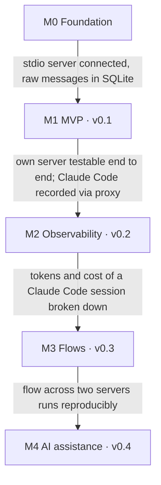

# MCP Studio — Product Spec

MCP Studio is a desktop tool for registering, testing, debugging, and orchestrating
[Model Context Protocol](https://modelcontextprotocol.io) servers — "Postman for MCP". It is built
with Tauri 2, a Rust core, and an Angular 22 frontend (the same stack as Bench).

## Audience

- Developers building their own MCP servers.
- Teams wiring third-party servers into agents who need to understand their behavior, cost, and
  quality.

## Positioning

- The official **MCP Inspector** is a web debugger for one server and one session. MCP Studio keeps
  many servers, collections, and history persistently on the local machine.
- **Postman** can talk to MCP, but it is API-first and cloud-centric. MCP Studio is offline-first,
  stores everything locally, and can record a server as a **proxy** while a real client (Claude
  Desktop, Claude Code, an IDE) is using it.
- Differentiators: proxy recording of real client sessions, context cost per server, and prompt
  flows across multiple servers with token and cost metering per tool call.

## Principles

- **Local first**: all data lives on the user's machine; secrets live in the OS keyring.
- **Rust owns the connections**: the webview never spawns processes or sees an API key.
- **Record everything once**: every JSON-RPC message passes through one recorder that feeds the
  inspector, tracing, and token metering.
- **Nothing runs without consent**: tool calls from generated flows or agent steps require
  confirmation by default, because MCP tools can have real side effects.

## Feature scope

| Feature                      | Milestone | Scope                                                                                                                              |
| ---------------------------- | --------- | ---------------------------------------------------------------------------------------------------------------------------------- |
| Register MCP servers         | M1 (v0.1) | stdio (command, args, env, cwd), Streamable HTTP (URL, headers, OAuth 2.1), import from `claude_desktop_config.json` / `.mcp.json` |
| Server explorer              | M1 (v0.1) | Capabilities, tools, resources, prompts, server info, and logs per server                                                          |
| Test tools                   | M1 (v0.1) | Form generated from JSON Schema plus raw JSON editor; result viewer for text, images, resource links                               |
| Inspect tool calls           | M1 (v0.1) | Every JSON-RPC message with timestamp, duration, size, error; filter and search                                                    |
| Proxy mode                   | M1 (v0.1) | Local stdio/HTTP endpoint that forwards to a real server and records a real client's session                                       |
| Collections and history      | M1 (v0.1) | Saved requests per server, environments with variables (like Postman)                                                              |
| Token metering               | M2 (v0.2) | Tokens per tool definition, call, and result; context cost of a server; price table                                                |
| Tracing                      | M2 (v0.2) | Spans per flow step and proxy session, waterfall view, OTLP export                                                                 |
| Prompt flows                 | M3 (v0.3) | Graph editor with LLM steps, tool calls, conditions, variables; runnable, reproducible, versionable as YAML                        |
| Automatic tool documentation | M4 (v0.4) | Markdown docs per server from schemas and recorded examples; lint of tool descriptions                                             |
| Prompt optimization          | M4 (v0.4) | Run prompt variants against test cases, compare accuracy and tokens                                                                |
| Flow generation              | M4 (v0.4) | Generate a flow from a natural-language goal and the available tools                                                               |

The MVP covers the core loop: add a server, connect, call tools, inspect every call — including
calls made by a real client through the proxy. Flows and AI features come once this loop is stable.

## Status

M0 and M1 are implemented (see the closed issues of milestones "M0 Foundation" and "M1 MVP"). Beyond the
plan, M1 includes OAuth 2.1 sign-in for HTTP servers, import from Claude Desktop / Claude Code
configurations, and ready-made client configuration snippets for the proxies. M2 to M4 are planned.

## Epics

1. Foundation and app shell
2. MCP connectivity
3. Explore and test
4. Inspector and proxy
5. Token metering and tracing
6. Prompt flows
7. AI assistance
8. Quality, packaging and release

## Milestones

Each milestone ends at a gate: a demo scenario, not a feature count. The next milestone starts only
once the gate passes.

| Milestone               | Scope                                                                                                                                         | Gate                                                                                      |
| ----------------------- | --------------------------------------------------------------------------------------------------------------------------------------------- | ----------------------------------------------------------------------------------------- |
| M0 Foundation           | Scaffold (Tauri 2, Angular 22, pnpm, Vitest, CI, Cargo workspace); spike: `rmcp` over stdio and HTTP, `RecordingTransport`, SQLite schema     | A stdio server is connected and every message is stored raw in SQLite                     |
| M1 MVP (v0.1)           | Registry with config import, explorer, playground with schema form, inspector timeline, proxy mode, collections, environments, history        | Own server testable end to end without a terminal; Claude Code recorded through the proxy |
| M2 Observability (v0.2) | Token metering per definition and call, context cost per server, prices; tracing waterfall for proxy sessions and flows; OTLP export          | Tokens and cost of a Claude Code session fully broken down                                |
| M3 Flows (v0.3)         | Graph editor with LLM steps, tool calls, conditions, variables; runner with confirmation before tool calls; every run is a trace; YAML format | A flow across two servers runs reproducibly                                               |
| M4 AI assistance (v0.4) | Tool docs and lint, prompt optimization against test suites, flow generation with validation                                                  | —                                                                                         |
| v1.0                    | Signed builds for Linux, Windows, and macOS; auto-update                                                                                      | —                                                                                         |

## AI features

All AI features run through `mcp-studio-llm` with the user's own API key (BYOK) and are hidden when
no key is configured. The default model is a current Claude model; local models via Ollama are
supported for sensitive servers.

1. **Automatic tool documentation** — Input: tool schemas, descriptions, and recorded example calls
   from history. Output: Markdown docs per server (purpose, parameters, examples, error cases) plus a
   lint report: vague descriptions, missing `required` fields, overlapping tools, oversized
   definitions.
2. **Prompt optimization** — A prompt or tool description runs against a small test suite (input plus
   expected tool or expected answer). The LLM proposes variants; MCP Studio measures accuracy and
   tokens per variant and shows the comparison.
3. **Flow generation** — The user describes a goal; the LLM receives the tool list of the selected
   servers and produces a flow graph in the internal format. The graph is validated (tools exist,
   schemas match) and opened in the editor for review — never executed unprompted.

## Risks

| Risk                                  | Impact                                                                             | Mitigation                                                                          |
| ------------------------------------- | ---------------------------------------------------------------------------------- | ----------------------------------------------------------------------------------- |
| The MCP spec changes quickly          | Transport or auth code goes stale                                                  | Depend on `rmcp` instead of a custom client; store the protocol version per session |
| Raw recording underneath `rmcp`       | The SDK may lack a clean hook                                                      | Custom transport wrapper around the byte stream; verify in the M0 spike             |
| stdio servers inherit the environment | Missing `PATH` entries (`npx`, `uvx`) in the GUI app                               | Resolve the login-shell `PATH` at startup; overridable per server                   |
| Token estimates are inaccurate        | Wrong cost statements                                                              | Label estimates clearly; exact counts via provider APIs                             |
| Competition (MCP Inspector, Postman)  | Little differentiation                                                             | Focus on proxy tracing, context cost, and flows                                     |
| Three platforms at once               | More test and release effort (macOS notarization, Windows signing, Linux packages) | CI matrix for all three platforms from M1; builds via the Tauri bundler             |

## Decisions

- **License**: open source to start; a Pro offering with extra features stays possible later
  (open core). Licensed `MIT OR Apache-2.0` ([ADR 0003](../adr/0003-license.md)).
- **Flow editor**: `@foblex/flow`, no custom SVG editor.
- **Flow format**: flows also exist as YAML files (Git-friendly); the visual editor and YAML are two
  views of the same graph.
- **Platforms**: Linux, Windows, and macOS together from v1.0.
- **Proxy mode** is part of the MVP (M1).

## Related documents

- [Architecture](architecture.md)
- [Data model](data-model.md)
- [Recording, proxy, token metering, and tracing](recording-and-observability.md)
- [Prompt flows](flows.md)
- [ADR 0001 — Stack and architecture](../adr/0001-stack-and-architecture.md)
- [ADR 0002 — Record at the rmcp transport layer](../adr/0002-recording-at-the-rmcp-transport-layer.md)
- [ADR 0003 — License](../adr/0003-license.md)
