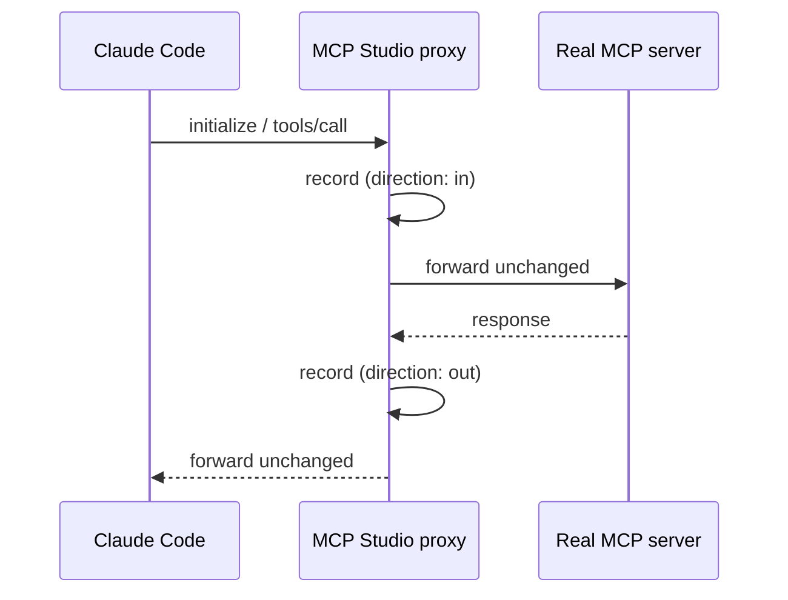

# Recording, Proxy, Token Metering, and Tracing

One recorder sees every JSON-RPC message; the inspector, proxy, token metering, and tracing are
views on what it records.

## RecordingTransport

- Wraps every `rmcp` transport (stdio child process, Streamable HTTP) and the proxy endpoints.
- For each message it captures: session, direction, raw payload, byte size, timestamp, JSON-RPC id,
  and method.
- Requests and responses are paired by JSON-RPC id to compute duration.
- Messages are written to SQLite in batches and emitted as `mcp://message` events.
- Recording must not change bytes on the wire; a failing write never blocks the connection.

**M0 spike question:** does `rmcp` allow wrapping its transports at the byte/message level? If not,
the recorder wraps the raw stream (child stdin/stdout, HTTP body) and parses JSON-RPC frames itself.

## Proxy mode

MCP Studio acts as a man-in-the-middle for a real client.

- **stdio proxy**: MCP Studio ships a small `mcp-studio-proxy` binary. The client config points at it
  (`mcp-studio-proxy --server <id>`); it connects to the running app over a local socket, and the app
  spawns and forwards to the real server.
- **HTTP proxy**: a local Streamable HTTP endpoint (`http://127.0.0.1:<port>/mcp/<server-id>`) that
  forwards to the upstream URL, including auth headers.
- The UI offers a "copy client config" button that generates the snippet for Claude Code
  (`.mcp.json`) and Claude Desktop.
- Proxy sessions are stored with `sessions.origin = 'proxy'`.

## Token metering

Tokens are measured at three points because each answers a different question.

| Measure point    | What is counted                                                          | Question                                                           |
| ---------------- | ------------------------------------------------------------------------ | ------------------------------------------------------------------ |
| Tool definitions | The `tools/list` response, as a client places it into the context window | How much context does this server consume before anything happens? |
| Tool call        | Arguments plus result content                                            | Which tool returns bloated results?                                |
| Flow / LLM step  | Real `usage` values from the LLM API (input, output, cache)              | What does one run cost?                                            |

- **Estimate**: offline estimation with a local tokenizer, clearly labeled as an approximation
  (`token_source = 'estimate'`).
- **Exact**: via the provider's token-counting endpoint or `usage` when an API key is configured
  (`token_source = 'exact'`).
- **Exact (implemented)**: the **Count exactly** action in the inspector sends one message's stored,
  secret-masked content to Anthropic's `count_tokens` endpoint, subtracts the fixed per-message
  overhead (measured once with a one-token text), and stores the result with
  `token_source = 'exact'`. It needs an API key in the OS keyring and never runs on its own.
- **Cost**: from the editable `prices` table; currency is configurable.

## Tracing

- Every session, flow run, and step is a span with a parent relation; messages attach to spans.
- The UI shows a waterfall with duration, tokens, and errors per row.
- Implemented: a session is a trace (`trace_id` = session id) with a `session` root span; every
  `tools/call` is a `tool` child span from request to response (`error` or `cancelled` when it
  fails or gets no answer). Messages point at their span through `messages.span_id`.
- The OTLP exporter speaks OTLP over HTTP with JSON encoding (`POST <endpoint>/v1/traces`), is off
  by default, sends only spans recorded after it is turned on, and sends metadata only (names,
  ids, timing, status, estimated tokens), never payloads. Header values such as API keys are
  keyring references.
- Internally Rust uses `tracing`; an optional OTLP exporter sends spans to Jaeger, Tempo, or Langfuse
  following the OpenTelemetry GenAI semantic conventions.
